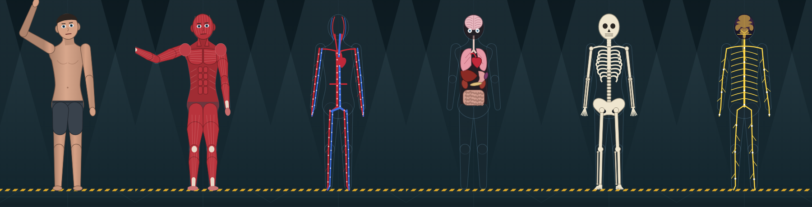

# HOMUNCULUS — alchemy & clinical observation lab

A sandbox game about brewing impossible mixtures and testing them on a test subject: a
lab-grown homunculus whose organs, brain regions, nerves, muscles and bones are all simulated
and shown on a live clinical monitor.

Pour mythical, elemental, scientific, fictional and biological reagents into a flask.
Heat it, stir it, distil it, bless it or irradiate it. Then give the result to the subject
by one of ten routes and watch what happens: in the chamber, where you can peel the body
layer by layer, and on the bedside monitor. Command the subject to walk, jump, lift, punch
or solve maths, and every command is recorded as a measured performance test.



## Play

- **No install:** open `dist/homunculus.html` in any modern browser. It is one
  self-contained file and runs straight from disk.
- **From source:** `npm start`, then open <http://localhost:8080>. Needs Node 18 or newer.
  There are no npm dependencies.

## What's in it

| System | Contents |
| --- | --- |
| Reagents | 120 substances in 5 categories: elemental, mythical, scientific, fictional, biological (pathogen cultures) |
| Bench | Burner from −200 to 1500 °C, 4 stir modes, 5 steeping times, 12 treatments (distil, centrifuge, filter, irradiate, electrify, enchant, bless, curse, moonlight, carbonate, magnetic containment, quantum entangle) |
| Chemistry | Real pH mixing and neutralisation, 24 reaction rules between ingredient aspects, catalysts, sterilisation by heat, fermentation over time, explosions for unstable brews, 37 named recipes to discover |
| Administration | Drink, IV, intramuscular, inhale, skin, eye drops, splash, spinal, intracranial, fumigate the chamber. Temperature and pH burn or freeze the contact site; powders injected undissolved can embolise |
| Body | Heart rhythm (sinus, afib, VF, asystole), blood pressure, breathing, SpO₂ and tissue oxygen, temperature, glucose, hydration, blood chemistry, 13 organs, 10 brain regions, 8 neurotransmitters, 6 nerve regions, 7 muscle groups, 16 bones |
| Effects | 87 effect types, from stimulant and neurotoxin to petrification, lycanthropy, time dilation and divinity |
| Diseases | 43 diseases with stages, symptoms, cures and outcomes: influenza, sepsis, rabies, stroke, radiation sickness, zombie plague, lycanthropy, the 1518 dancing plague and more |
| Transformations | Stone, zombie, werewolf, vampire, ghost, crystal, metal, gold, rubber, divine; plus 12 mutations (wings, extra arms, third eye, gills…) |
| Chamber | 6 anatomy layers (skin, muscle, circulatory, organs, skeleton, nerves), X-ray, thermal and damage overlays, health labels, hover-to-inspect any body part |
| Subject | 24 commands with obedience based on hearing, comprehension, frontal-lobe function, fear and rage; involuntary behaviour (vomiting, seizures, fleeing, dancing, hallucinating); speech that slurs, stutters or garbles with the brain state |
| Monitor | 8 vital tiles with alarms, ECG / pleth / respiration / EEG sweeps, tabs for organs, brain, nerves, muscles, skeleton, blood, conditions, active doses and test results |
| Environment | Air temperature, gravity, oxygen and background radiation |
| Tools | Defibrillator, stabilisation, dialysis, full restore, new subject |

## Experiments to try

- Inject **Potassium Cyanide** and watch SpO₂ stay normal while the subject suffocates at the cellular level.
- Brew **Werewolf Saliva** under **Moonlight**, then ask the subject to wave.
- Splash **Fire Essence**, then put it out with **Pure Spring Water**.
- Give **Morphine** and look at the pupils in the skin layer; then give **Caffeine** and compare.
- Give **Growth Hormone** and turn gravity up: large bodies start breaking under their own weight.
- Inject **Liquid Nitrogen** to freeze the subject into cryostasis, then warm the chamber to thaw it. Drinking it instead ruptures the stomach.
- Infect it with the **Z-Strain Vial**, wait, then splash **Holy Water**.
- Put **Antimatter** in the flask without magnetic containment. Once.

## Controls

`Space` pause · `1`–`6` anatomy layers · `W` walk · `R` run · `J` jump · `L` lift · `P` punch ·
`K` kick · `D` dance · `B` balance · `T` speak · `Q` solve · `←`/`→` move. You can also type
commands such as `say hello` or `sprint`.

## Development

```
npm start        # dev server on :8080 serving the ES modules directly
npm test         # node:test suite: data integrity, chemistry, physiology, behaviour, bundling
npm run build    # writes dist/homunculus.html (single file) and dist/artifact.html (body fragment)
```

```
index.html            page shell (markers delimit the parts the bundler inlines)
css/style.css         all styling
js/data/              vocab (the shared contract), substances, recipes, diseases, speech
js/sim/               mixer, pharmacology, physiology, diseases, behaviour — no DOM
js/render/            pose rig, layered anatomy renderer, chamber/particles, monitor waveforms
js/ui/                lab bench, monitor panel, chamber controls, codex, audio
scripts/              zero-dependency dev server and bundler
tests/                node:test suites
docs/DESIGN.md        the plan: pillars, systems and the simulation model
```

The simulation modules never touch the DOM, so the whole body can be run headless in Node
(see `tests/helpers.mjs`).

**Bundler convention:** modules use plain named `import { a } from './x.js'` and `export`
declarations, and every top-level name must be unique across the project. `npm run build`
and the test suite fail loudly on a collision.

### Adding content

- **A reagent:** add an entry to `js/data/substances.js`. Effect magnitudes are the intensity
  that 10 ml of the pure substance produces when injected (0.5 mild, 1 clear, 2 strong, 4 severe).
- **A recipe:** add to `js/data/recipes.js` with its ingredients, optional process conditions
  and bonus effects. The test suite checks that every recipe can actually be brewed.
- **A disease:** declare its id in `js/data/vocab.js` (`DISEASE_IDS`), then define its stages,
  cures, triggers and outcome in `js/data/diseases.js`.

Everything a data file may reference (tags, effects, symptoms, organs, stats) is declared in
`js/data/vocab.js`, and `tests/data.test.mjs` rejects anything that is not.

## Disclaimer

The physiology is inspired by real medicine but simplified and time-compressed for play.
It is a game, not a medical reference.
